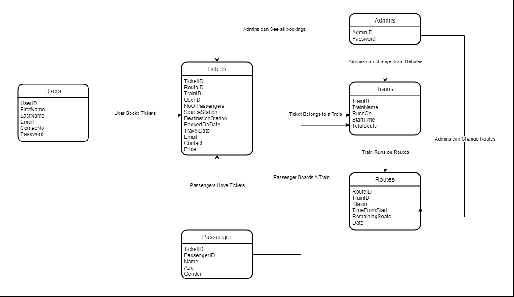
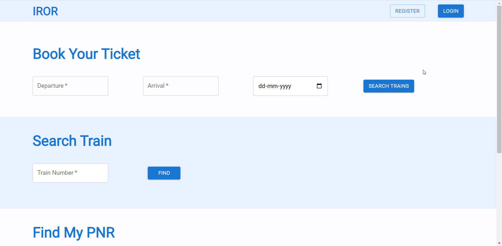

# SDE API Round - IRCTC

# Problem Statement

Hey there, Mr. X. You have been appointed to design a railway management system like IRCTC, where users can come on the platform and
check if there are any trains available between 2 stations.
The app will also display how many seats are available between any 2 stations and the user can book a seat if the availability > 0 after
logging in. Since this has to be real-time and multiple users can book seats simultaneously, your code must be optimized enough to handle
large traffic and should not fail while doing any bookings.
If more than 1 users simultaneously try to book seats, only either one of the users should be able to book. Handle such race conditions
while booking.
There is a Role Based Access provision and 2 types of users would exist :
1. Admin - can perform all operations like adding trains, updating total seats in a train, etc.
2. Login users - can check availability of trains, seat availability, book seats, get booking details, etc.

# Requirements
1. Register a User
Create an endpoint for registering a user.
2. Login User
Provide the ability to the user to log into his account
3. Add a New Train
An endpoint for the admin to create a new train with a source and destination
4. Get Seat Availability
Create an endpoint for the users where they can enter the source and destination and fetch all the trains between that route with their
availabilities
5. Book a Seat
Create an endpoint for the users to book a seat on a particular train
6. Get Specific Booking Details
Create an endpoint for the users to book a seat on a particular train

# Relation Model 

| Entities | Attributes |
| --- | --- |
| Users | UserID, Email, ContactNo, FirstName, LastName, Password |
| Trains | TrainID, TrainName, RunsOn, StartTime, TotalSeats |
| Routes | RouteID, TrainID, Station, TimeFromStart, RemainningSeats, Date |
| Tickets | TicketID, TrainID, RouteID, UserID, NoOfPassengers, SourceStation, DestinationStation, ContactNo, Email, Price |
| Passengers | PassengerID, TicketID, Name, Age, Gender |

# Frontend Screenshots

### Home Page - Without Login

### Change Password

### Admin Login Page

### Home Page - Admin Mode

### View All Bookings

### View All Trains

### Delete Train

### Add Train

